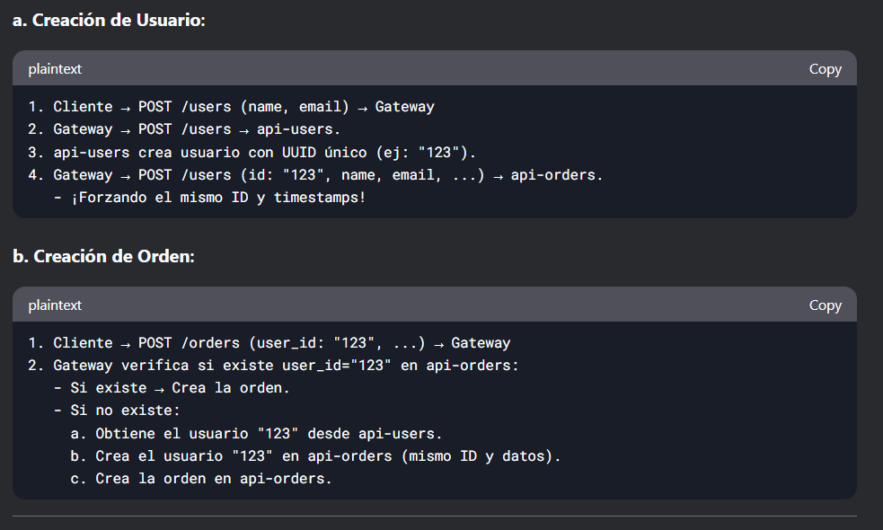

### a.- Creacion de usuario
1. Cliente → POST /users (name, email) → Gateway
2. Gateway → POST /users → api-users.
3. api-users crea usuario con UUID único (ej: "123").
4. Gateway → POST /users (id: "123", name, email, ...) → api-orders.
   - ¡Forzando el mismo ID y timestamps!

### b.- Creacion de orden
1. Cliente → POST /orders (user_id: "123", ...) → Gateway
2. Gateway verifica si existe user_id="123" en api-orders:
   - Si existe → Crea la orden.
   - Si no existe:
     a. Obtiene el usuario "123" desde api-users.
     b. Crea el usuario "123" en api-orders (mismo ID y datos).
     c. Crea la orden en api-orders.

